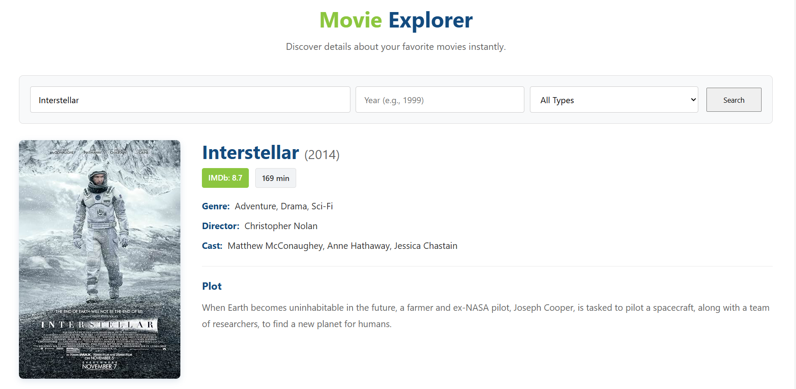
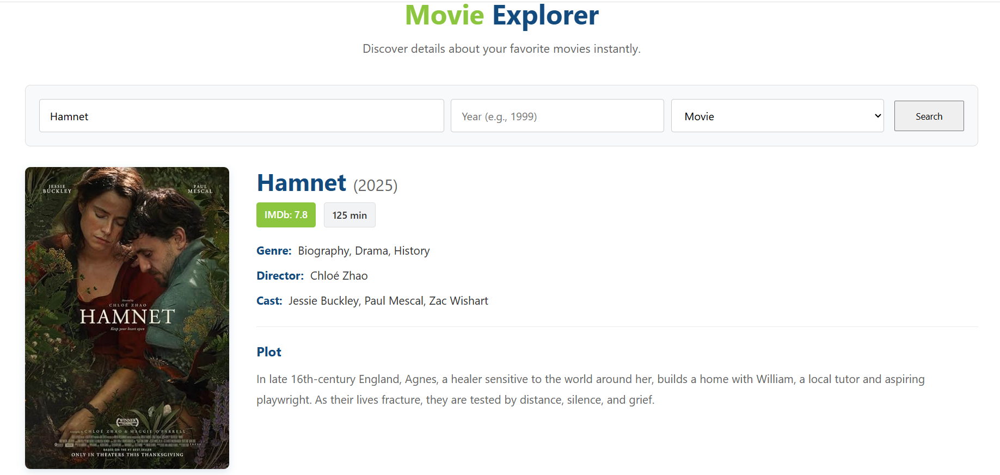

# OMDB Movie Search Project

A clean, responsive, and performance-optimized Single Page Application built with Vanilla JavaScript. It consumes the OMDb API to help users search for movies and series, utilizing advanced caching mechanisms to minimize redundant API requests.

**[Click here to view the Live Demo](https://ramazanbiyiik.github.io/omdb-project/)**

---

### Screenshots

 
*Search results and movie detail view*
 
*Search results and movie detail view*

---

## Features & Bonus Implementations

This project strictly follows the required assessment guidelines and introduces several bonus functionalities for better performance and user experience:

* **Advanced Search & Filtering:** Users can filter search results not just by title, but also by **Year** and **Type** (Movie or Series) to get more accurate results.
* **Smart Persistent Caching:** Implemented a highly efficient caching mechanism via `LocalStorage`. If a previously searched movie is queried again, the app fetches the data instantly from the local cache instead of making a redundant API call.
* **State Retention:** The app survives page refreshes. The last viewed movie data is automatically loaded from the persistent cache without triggering a new network request on reload.
* **Responsive Modern UI:** Designed with a corporate and clean color palette based on the provided branding. Built with CSS Flexbox to ensure a seamless experience across desktop, tablet, and mobile screens.
* **Robust Error Handling:** Gracefully handles scenarios like "Movie not found" or network failures with user-friendly UI messages instead of breaking the application.

---

## Technologies Used

* **HTML5 & CSS3** (Flexbox, CSS Variables, Responsive Design)
* **Vanilla JavaScript** (Async/Await, Fetch API, DOM Manipulation)
* **Web Storage API** (`LocalStorage` for caching JSON responses)
* **OMDb API** (External REST API for fetching movie data)

---

## Installation & Local Setup

To run this project locally on your machine:

1. **Clone the repository:**
   ```bash
   git clone [https://github.com/YOUR_USERNAME/omdb-project.git](https://github.com/YOUR_USERNAME/omdb-project.git)

## How to Set Up Your Repository

**WARNING**: This is a template project. Do not fork this repository.

Please follow the visual steps below to create and set up the project repository on your own GitHub profile.

1. Click the **"Use this template"** button at the top right of this page.


<br><br>

2. Select **"Create a new repository"** to generate your own public repository for this task.


<br><br>

3. Name your repository as **"omdb-project"** and click the **"Create repository"** button.


<br><br>

Upload all of your solutions to `github.com/yourusername/omdb-project`.

---

## Overview

This project is designed to evaluate your coding skills in web development. You are required to build a simple web application that consumes the [OMDB API](http://www.omdbapi.com/).

* The application must be a fully responsive **Single Page Application (SPA)** and should display movie details such as **title, year, genre, director, and poster**.
* The application must be written using **HTML, CSS, and JavaScript**.
* If your project meets all the requirements, you may extend it with additional functionalities.
* After development, you must deploy the project using [GitHub Pages](https://pages.github.com). **Projects that are not deployed to GitHub Pages will not be evaluated and will receive 0 points.**

You must **create your own repository using this template** and upload your work there. 
Do **not** attempt to push changes directly to this repository or any of its original branches.

---

## Functional Requirements

1. **Movie Search Input**
   - Users must be able to enter a movie name and trigger a search.
   - A search box and button are sufficient, but adding well-composed UI elements (e.g., filters similar to sahibinden.com) will earn bonus points.

2. **Display Movie Details**
   - Show at least: Title, Year, Genre, Director, and Poster image.
   - The design is up to you.

3. **Error Handling**
   - If the movie is not found or the API returns an error, display a clear message to the user.
   - Unhandled errors will result in point deductions.

4. **Multiple Searches**
   - Users should be able to perform multiple searches without refreshing the page.
   - If the page is refreshed, the last search view should be retained (e.g., using LocalStorage or URL parameters).

5. **Backend Proxy (Optional)**
   - If you implement a backend, it should handle API requests and return clean JSON to the frontend.

---

## Non-Functional Requirements

1. **Performance**
   - API calls should be efficient. Avoid unnecessary repeated requests.

2. **Usability**
   - The interface should be simple, intuitive, and user-friendly.
   - The design is up to you.

3. **Portability**
   - The application should work across modern browsers and be responsive for different screen sizes.

4. **Maintainability**
   - Code should be modular, well-documented, and easy to extend.

---

## Deliverables & Submission

Once you have completed the project, ensure you have the following ready:
- A **public GitHub repository** containing your project code (created via the template).
- A **hosted version** of the project deployed on GitHub Pages.
